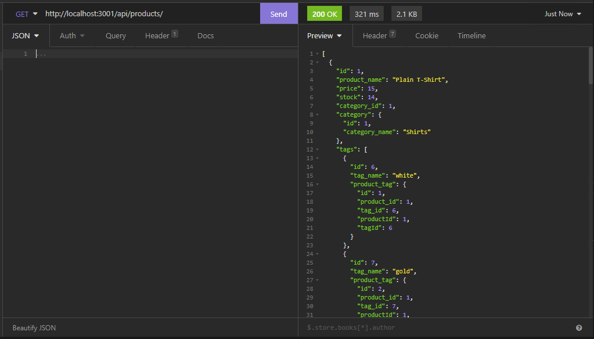
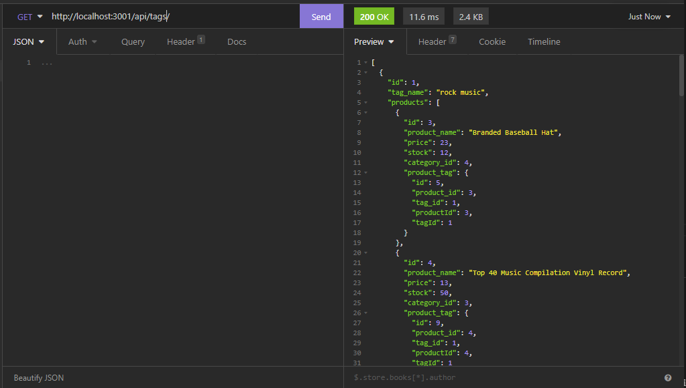

# retail-store
This is an API that lets you work with a locally hosted MySQL server to manage a retail store. You can add things such as products, categories, and tags.

## Technologies
* <a href="https://github.com/sidorares/node-mysql2">MySQL2</a>
* Sequelize
* expressjs

## What was the point?
The point of this is to provide an easy way for a user to interact with the DB by making API calls. For me, it was an opportunity to work with Sequelize and continue practicing express.

## Lessons Learned
The main point of learning for me was how to interact with an intermediate table in a many-to-many relationship in Sequelize.

## Usage Information
Of course! Take a look at the video below which will get you started!\
<a href="https://watch.screencastify.com/v/BtEknavHgbp9BELabRSZ">Demo Video</a>

## Installation
(You will need to have MySql installed. I used the CLI MySql tool)
1. Clone it
2. Run an npm install in the root folder
3. Run the schema.sql file
4. If you want seed data, run the seeds/index.js file
5. Run node index.js from the root
6. Enjoy!
You can also check out the Usage video for a quick setup example!

## Improvements
* Create more tables
* Add a frontend

## Screenshots

